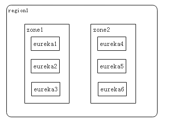

# 4.4 Eureka原理

## regin、zone、Eureka集群的关系

在分析Eureka原理之前，我们需要知道region、zone、Eureka集群三者的关系。Eureka的官方文档对regin、zone的描述非常抽象，新手很难理解。

图4-2简单描述了三者之间的大致关系：

图4-2 region、zone、Eureka集群之间的关系

Eureka的region和zone（或者Availability Zone）均是AWS的概念，在非AWS环境下，我们可以简单地将region认为是我们的整个Eureka集群。

对region和zone感兴趣的读者可前往[http://blog.csdn.net/awschina/article/details/17639191](http://blog.csdn.net/awschina/article/details/17639191) 扩展阅读，Spring Cloud中默认的region是`us-east-1` 。

## Eureka架构

图4-3 Eureka架构图

图4-3是来自Eureka官方的架构图，大致描述了Eureka集群的工作过程。图中包含的组件非常多，可能比较难以理解，我们用通俗易懂的语言解释一下：

* Application Service 相当于本书中的服务提供者，Application Client相当于本书中的服务消费者；
* Make Remote Call，可以简单理解为调用RESTful API；
* us-east-1c、us-east-1d等都是zone，它们都属于us-east-1这个region；

由图可知，Eureka包含两个组件：Eureka Server 和 Eureka Client，它们的作用如下：

* Eureka Client是一个Java客户端，用于简化与Eureka Server的交互；

* Eureka Server提供服务发现的能力，各个微服务启动时，会通过Eureka Client向Eureka Server进行注册自己的信息（例如网络信息），Eureka Server会存储该服务的信息；
* 微服务启动后，会周期性地向Eureka Server发送心跳（默认周期为30秒）以续约自己的信息。如果Eureka Server在一定时间内没有接收到某个微服务节点的心跳，Eureka Server将会注销该微服务节点（默认90秒）；
* 每个Eureka Server同时也是Eureka Client，多个Eureka Server之间通过复制的方式完成服务注册表的同步；
* Eureka Client会缓存Eureka Server中的信息。即使所有的Eureka Server节点都宕掉，服务消费者依然可以使用缓存中的信息找到服务提供者。

综上，Eureka通过心跳检测、健康检查和客户端缓存等机制，提高了系统的灵活性、可伸缩性和可用性。

